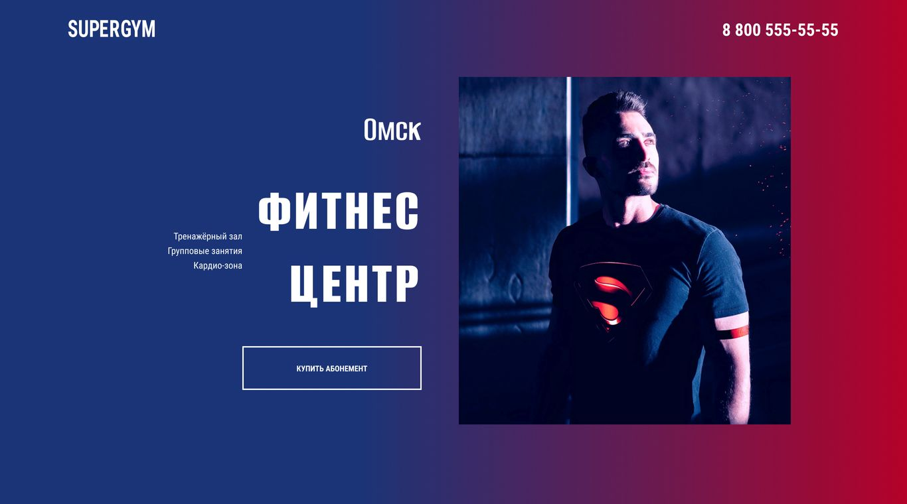

# 📋 Личный проект «Supergym»

**Самостоятельно выполненный проект, написанный с использованием HTML, CSS и JavaScript в соответствии с техническим заданием, критериями качества HTML Academy, стайлгайдом, принципом Pixel Perfect.**

*Первый проект, выполненный в рамках «Aкселератора» HTML Academy - финального самостоятельного этапа производства.*



## 💡 Обзор выполненных задач

### ✔ Написание HTML-разметки
Создание семантически правильной и структурированной HTML-разметки, обеспечивающей доступность и SEO-оптимизацию.

### ✔ Адаптивная верстка на SCSS
Разработка адаптивных стилей с использованием SCSS, обеспечивающих корректное отображение сайта на различных устройствах (desktop, tablet, mobile). Использован подход Mobile First.

### ✔ Реализация JavaScript функциональности
Добавление интерактивных элементов и динамической логики с использованием JavaScript.  Реализованы следующие функции:
-  ленивая загрузка iframe с видео при взаимодействии с кнопкой play в блоке «Тренажерный зал».
-  табы, меняющие стоимость абонементов в зависимости от срока в блоке «Абонементы».
-  слайдеры в блоках «Жюри» и «Отзывы» с использованием библиотеки Swiper.js (путем локального подключения файлов библиотеки в проект).
-  аккордеон и табы в блоке «Вопросы и ответы».
-  валидация формы в блоке «Бесплатное занятие».
-  маска ввода у поля с номером телефона в блоке «Бесплатное занятие».


## 📖 Библиотеки

- [Swiper.js](https://swiperjs.com/).


## 🛠 Технологии и инструменты

- HTML5
- SCSS
- JavaScript (ES6+)
- БЭМ-методология
- SVG-спрайты, WebP
- оптимизация графики, в т.ч. для Retina-дисплеев
- Git
- VS Code
- Figma


## 📌 Ссылка на проект

https://anastasiya-lemeshko.github.io/supergym/


## 🚀 Установка и запуск:

**Установка Node.js и NPM**:
- Установите Node.js (поддерживаемая версия 18+).
- Для установки зависимостей необходимо выполнить команду
```bash
npm i
```

**Запуск проекта**:
- Запустите сервер с помощью команды
```bash
npm run start
```
- Сервер будет доступен по адресу `http://localhost:3000`.
